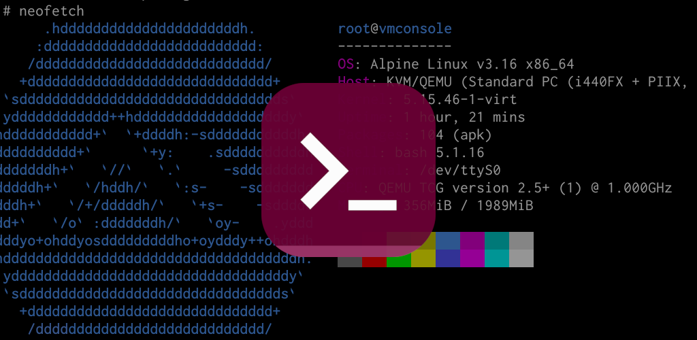
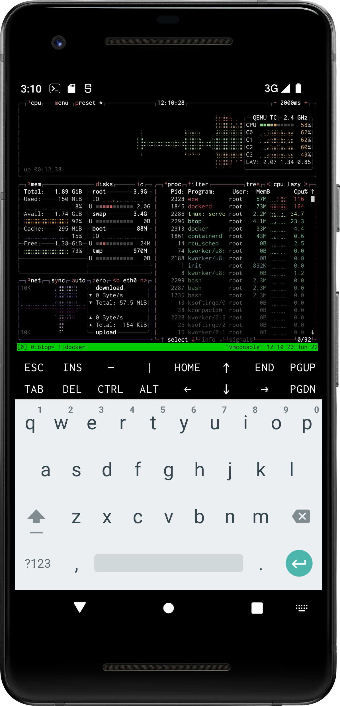
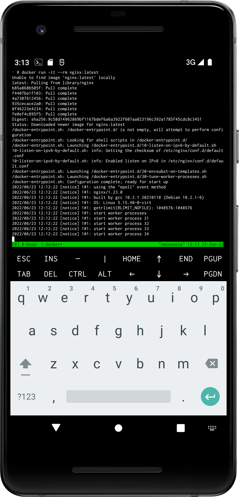
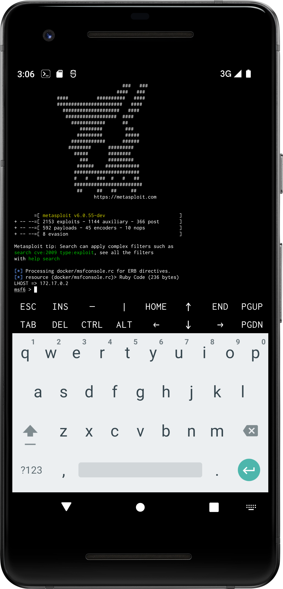

# vmConsole

A free and open-source application that enables you to run [Alpine Linux]
distribution in a virtual machine on your Android device. Thousands of
packages available for installation from online repositories make vmConsole
a powerful tool for software developers, testers, system administrators
and just Linux fans. The core of application is [QEMU] x86_64 emulator, so
you do not need superuser permissions, KVM support or other special features
of device. Input and output are being performed through Xterm-compatible
terminal screen.

  
  

Typical use-cases of vmConsole application:

- Exploring the world of Linux =)
- Programming
- Testing software
- Hacking
- Running TOR hidden services
- Crawling / archiving web sites

Application runs on any modern device with [Android OS] 7.0 or higher. For
the best experience, it is recommended to have 6+ GiB of RAM and 8+ GiB of
free disk space.

Our [Wiki](https://github.com/sylirre/vmConsole/wiki) provides details about
application usage and various tips. Currently it is basic, but will grow over
time. Also it is highly recommended to visit [Alpine Linux Wiki].

**Proper Linux administration skills are needed in order to use vmConsole!**
I do not advertise my application as entertainment tool or game. If you do
not have any specific tasks in mind to solve with it, most likely the
vmConsole will be useless for you.

  
  
  

## About project

vmConsole, previously known as "Alpine Term" or "vShell", was started as an
alternative to currently available implementations of Linux environments for
[Android OS]. Android by itself is quite (reasonably) restricted operating
system and that makes hit on Linux userland approaches. Another issues are
stability, like with barely maintained [Limbo PC] or PRoot-based [UserLAnd],
and high efforts required for maintaining a package repository like in case
of [Termux].

So the main idea was to combine terminal emulator, adequate and up-to-date
[QEMU] port to Android OS and a tiny, but production-grade Linux distribution.
As for latter, I have picked the [Alpine Linux] as it much better suits as
operating system for [QEMU], small and does not rely on systemd.

**Notice**: this project does not apply community-led development approach.
Pull requests can be rejected if they does not suit well goals of the
vmConsole project and rather could be treated as customization instead of
enhancement.

Remember that [author] does not owe anything for you.

## Credits

- [Alpine Linux]: the operating system used in vmConsole.
- [ConnectBot]: the recommended SSH client for use with vmConsole.
- [QEMU]: the emulator and virtualizer, a core of vmConsole.
- [Termux]: the famous terminal emulator for [Android OS], vmConsole uses certain parts of it.

[author]: https://github.com/sylirre
[Android OS]: https://www.android.com
[Alpine Linux]: https://alpinelinux.org
[Alpine Linux Wiki]: https://wiki.alpinelinux.org/wiki/Main_Page
[ConnectBot]: https://github.com/connectbot/connectbot
[Limbo PC]: https://github.com/limboemu/limbo
[QEMU]: https://qemu.org
[Termux]: https://termux.dev
[UserLAnd]: https://github.com/CypherpunkArmory/UserLAnd
